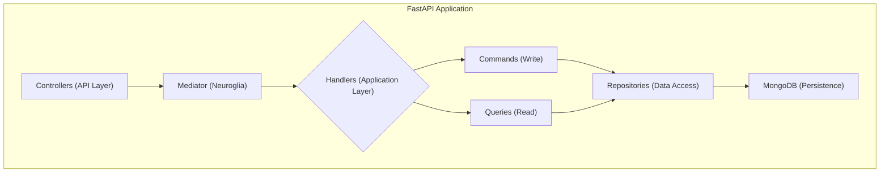

# Welcome to the Starter App

This project is a template application that demonstrates how to build a modern web application using the **[neuroglia-python](https://github.com/bvandewe/pyneuro)** framework. It provides a solid foundation for building clean, scalable, and maintainable applications with Python.

**[Online Documentation](https://bvandewe.github.io/starter-app/)**

## Getting Started

To get started with the application, please refer to the **[Getting Started](getting-started/installation.md)** guide, which will walk you through the installation and setup process.

## Key Sections

- **[Architecture](architecture/overview.md)**: Learn about the core concepts of the application's architecture and the `neuroglia-python` framework.
- **[Security](security/authentication-flows.md)**: Understand the dual authentication system, including session-based and JWT bearer token flows, plus authorization with OAuth2/OIDC.
- **[Development](development/makefile-reference.md)**: Find information on the development workflow, including the `Makefile` commands and documentation setup.
- **[Deployment](deployment/docker-environment.md)**: Learn how to deploy the application using Docker and other related technologies.

## 🛠️ Technology Stack

### Backend

- **Framework**: [Neuroglia Python](https://github.com/neuroglia-io/python-framework)
- **Web**: [FastAPI](https://fastapi.tiangolo.com/)
- **Database**: [MongoDB](https://www.mongodb.com/) with [Motor](https://motor.readthedocs.io/)
- **Cache**: [Redis](https://redis.io/)
- **Auth**: [Keycloak](https://www.keycloak.org/)

### Frontend

- **Bundler**: [Parcel](https://parceljs.org/)
- **Templates**: [Nunjucks](https://mozilla.github.io/nunjucks/)
- **Styles**: [Bootstrap 5](https://getbootstrap.com/) + [SCSS](https://sass-lang.com/)
- **JavaScript**: ES6 Modules

### Infrastructure

- **Containers**: [Docker](https://www.docker.com/) + [Docker Compose](https://docs.docker.com/compose/)
- **Observability**: [OpenTelemetry](https://opentelemetry.io/)
- **Documentation**: [MkDocs Material](https://squidfunk.github.io/mkdocs-material/)

## 🤝 Contributing

This is a starter app template. When adapting for your project:

### Keep the Patterns

- ✅ Authentication architecture
- ✅ CQRS structure
- ✅ Dependency injection setup
- ✅ Frontend build pipeline
- ✅ Docker development environment

### Customize the Domain

- 🔧 Replace Task entities with your models
- 🔧 Update UI components and styling
- 🔧 Configure Keycloak realms and roles
- 🔧 Adapt database schema
- 🔧 Add your API endpoints

### Extend as Needed

- ➕ Additional auth providers
- ➕ More command/query handlers
- ➕ Event sourcing
- ➕ Background jobs
- ➕ API versioning

## 📚 Additional Resources

### Documentation

- [GitHub Repository](https://github.com/bvandewe/starter-app)
- [API Documentation](http://localhost:8020/api/docs) (when running)
- [Deployment Guide](deployment/github-pages-setup.md)

### External Links

- [Neuroglia Framework](https://github.com/neuroglia-io/python-framework)
- [FastAPI Docs](https://fastapi.tiangolo.com/)
- [MkDocs Material](https://squidfunk.github.io/mkdocs-material/)

## 🆘 Getting Help

1. Check [Common Issues](troubleshooting/common-issues.md)
2. Review relevant documentation section
3. Search [GitHub Issues](https://github.com/bvandewe/starter-app/issues)
4. Create a new issue with details

---

**Ready to start?** Head to the [Docker Environment](infrastructure/docker-environment.md) guide to get your development environment running!
